<h2>Tensorflow-Image-Segmentation-Augmented-Breast-Ultrasound (2024/11/12)</h2>

This is an experiment of Image Segmentation for Breast-Ultrasound
 based on 
the latest <a href="https://github.com/sarah-antillia/Tensorflow-Image-Segmentation-API">Tensorflow-Image-Segmentation-API</a>, and
<a href="https://drive.google.com/file/d/1GcupOkETeymYR-WiGVW7i1Q7K1_94gAN/view?usp=sharing">
512x512 pixels Breast-Ultrasound-ImageMask-Dataset.zip</a>, which was derived by us from  
<a href="https://www.kaggle.com/datasets/aryashah2k/breast-ultrasound-images-dataset">
Breast Ultrasound Images Dataset
</a>
 
 
<b>Data Augmentation Strategy:</b> 
 To address the limited size of the Breast-Ultrasound dataset, 
 we employed <a href="./src/ImageMaskAugmentor.py">an online augmentation tool</a> to enhance segmentation accuracy, which supports the following aumentation methods.
<li>Horizontal flip</li>
<li>Rotation</li>
<li>Shrinks</li>
<li>Shears</li> 
<li>Deformation</li>
<li>Distortion</li>
<li>Barrel distortion</li>
<li>Pincushion distortion</li>
 

 

<b>Actual Image Segmentation for Images</b> 
As shown below, the inferred masks look similar to the ground truth masks.  

<table>
<tr>
<th>Input: image</th>
<th>Mask (ground_truth)</th>
<th>Prediction: inferred_mask</th>
</tr>
<tr>
<td></td>
<td></td>
<td></td>
</tr>

<tr>
<td></td>
<td></td>
<td></td>
</tr>

<tr>
<td></td>
<td></td>
<td></td>
</tr>
</table>

 
In this experiment, we used the simple UNet Model 
<a href="./src/TensorflowUNet.py">TensorflowSlightlyFlexibleUNet</a> for this Breast-UltrasoundSegmentation Model. 
As shown in <a href="https://github.com/sarah-antillia/Tensorflow-Image-Segmentation-API">Tensorflow-Image-Segmentation-API</a>.
you may try other Tensorflow UNet Models: 

<li><a href="./src/TensorflowSwinUNet.py">TensorflowSwinUNet.py</a></li>
<li><a href="./src/TensorflowMultiResUNet.py">TensorflowMultiResUNet.py</a></li>
<li><a href="./src/TensorflowAttentionUNet.py">TensorflowAttentionUNet.py</a></li>
<li><a href="./src/TensorflowEfficientUNet.py">TensorflowEfficientUNet.py</a></li>
<li><a href="./src/TensorflowUNet3Plus.py">TensorflowUNet3Plus.py</a></li>
<li><a href="./src/TensorflowDeepLabV3Plus.py">TensorflowDeepLabV3Plus.py</a></li>

 

<h3>1. Dataset Citation</h3>
The dataset used here has been taken from the kaggle web-site
<a href="https://www.kaggle.com/datasets/aryashah2k/breast-ultrasound-images-dataset">
Breast Ultrasound Images Dataset
</a>
 
 
<b>About Dataset</b> 

Breast cancer is one of the most common causes of death among women worldwide. Early detection helps  
in reducing the number of early deaths. The data reviews the medical images of breast cancer using  
ultrasound scan. Breast Ultrasound Dataset is categorized into three classes: normal, benign, and  
malignant images. Breast ultrasound images can produce great results in classification, detection,  
and segmentation of breast cancer when combined with machine learning. 
 

<b>Data</b> 
The data collected at baseline include breast ultrasound images among women in ages between 25 and  
75 years old. This data was collected in 2018. The number of patients is 600 female patients.  
The dataset consists of 780 images with an average image size of 500*500 pixels. The images are in PNG format.  
The ground truth images are presented with original images. The images are categorized into three classes,  
which are normal, benign, and malignant. 
 
If you use this dataset, please cite: 
Al-Dhabyani W, Gomaa M, Khaled H, Fahmy A. Dataset of breast ultrasound images. Data in Brief. 2020 Feb;28:104863.  
DOI: 10.1016/j.dib.2019.104863. 
 
<b>License</b> 
CC0: Public Domain

 
 
<h3>
<a id="2">
2 Breast-Ultrasound-ImageMask Dataset
</a>
</h3>
 If you would like to train this Breast-UltrasoundSegmentation model by yourself,
 please download the dataset from the google drive 
<a href="https://drive.google.com/file/d/1GcupOkETeymYR-WiGVW7i1Q7K1_94gAN/view?usp=sharing">
512x512 pixels Breast-Ultrasound-ImageMask-Dataset.zip</a>,
, expand the downloaded ImageMaskDataset and put it under <b>./dataset</b> folder to be
<pre>
./dataset
└─Breast-Ultrasound
    ├─test
    │   ├─images
    │   └─masks
    ├─train
    │   ├─images
    │   └─masks
    └─valid
        ├─images
        └─masks
</pre>

<b>Breast-Ultrasound Statistics</b> 
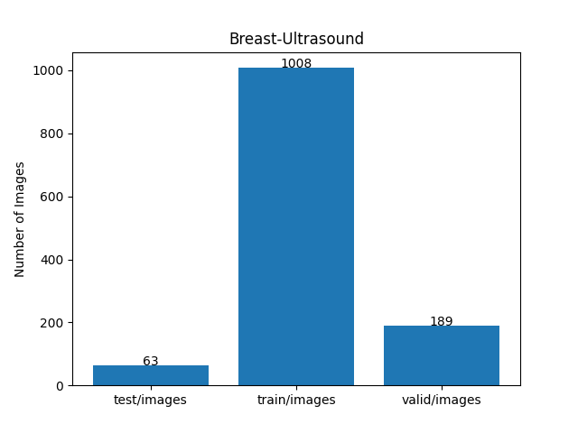 
 
As shown above, the number of images of train and valid datasets is not enough to use for a training set of our segmentation model.
Therefore the online dataset augmentation strategy may be effective to improve segmentation performance.
 
 
<b>Train_images_sample</b> 
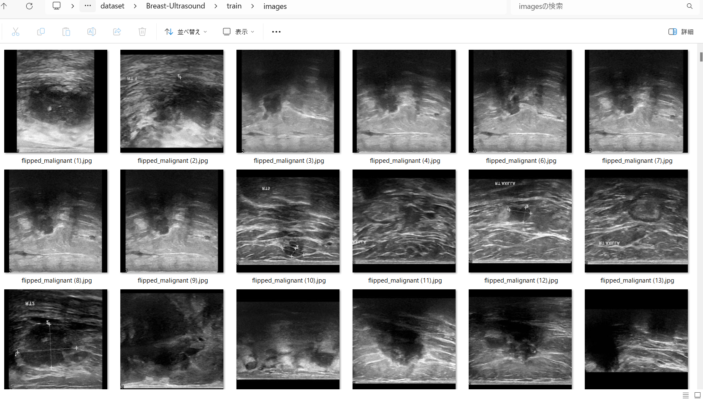
 
<b>Train_masks_sample</b> 
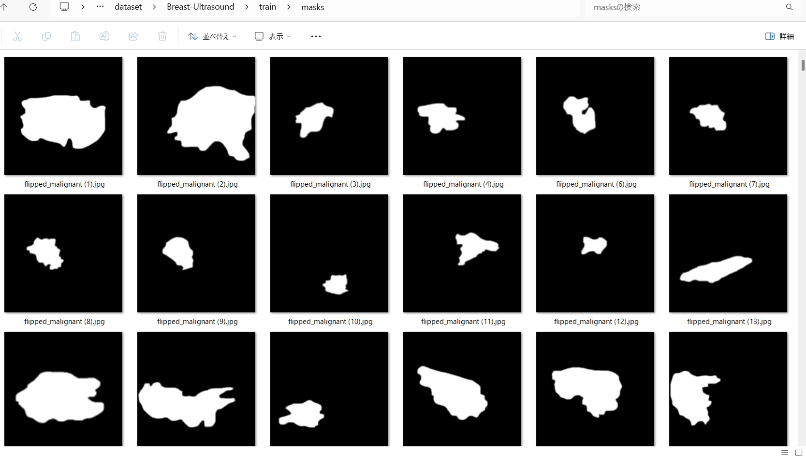
 

<h3>
3 Train TensorflowUNet Model
</h3>
 We have trained Breast-Ultrasound TensorflowUNet Model by using the following
<a href="./projects/TensorflowSlightlyFlexibleUNet/Breast-Ultrasound/train_eval_infer.config"> <b>train_eval_infer.config</b></a> file.  
Please move to ./projects/TensorflowSlightlyFlexibleUNet/Breast-Ultrasoundand run the following bat file. 
<pre>
>1.train.bat
</pre>
, which simply runs the following command. 
<pre>
>python ../../../src/TensorflowUNetTrainer.py ./train_eval_infer.config
</pre>

<b>Model parameters</b> 
Defined a small <b>base_filters</b> and large <b>base_kernels</b> for the first Conv Layer of Encoder Block of 
<a href="./src/TensorflowUNet.py">TensorflowUNet.py</a> 
and a large num_layers (including a bridge between Encoder and Decoder Blocks).
<pre>
[model]
base_filters   = 16
base_kernels   = (9,9)
num_layers     = 8
dilation       = (3,3)
</pre>

<b>Learning rate</b> 
Defined a small learning rate.  
<pre>
[model]
learning_rate  = 0.0001
</pre>

<b>Online augmentation</b> 
Enabled our online augmentation.  
<pre>
[model]
model         = "TensorflowUNet"
generator     = True
</pre>

<b>Loss and metrics functions</b> 
Specified "bce_dice_loss" and "dice_coef". 
<pre>
[model]
loss           = "bce_dice_loss"
metrics        = ["dice_coef"]
</pre>
<b>Learning rate reducer callback</b> 
Enabled learing_rate_reducer callback, and a small reducer_patience.
<pre> 
[train]
learning_rate_reducer = True
reducer_factor     = 0.4
reducer_patience   = 4
</pre>

<b>Early stopping callback</b> 
Enabled early stopping callback with patience parameter.
<pre>
[train]
patience      = 10
</pre>

<b>Epoch change inference callbacks</b> 
Enabled epoch_change_infer callback. 
<pre>
[train]
epoch_change_infer       = True
epoch_change_infer_dir   =  "./epoch_change_infer"
epoch_changeinfer        = False
epoch_changeinfer_dir    = "./epoch_changeinfer"
num_infer_images         = 6
</pre>

By using this callback, on every epoch_change, the inference procedure can be called
 for 6 images in <b>mini_test</b> folder. This will help you confirm how the predicted mask changes 
 at each epoch during your training process.    

<b>Epoch_change_inference output</b> 
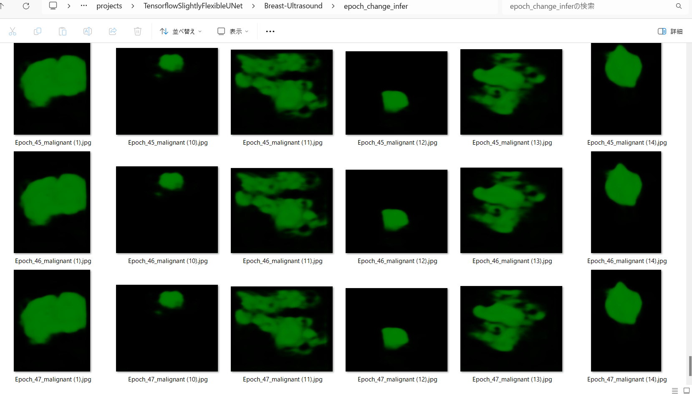 
 

In this experiment, the training process was stopped at epoch 47  by EarlyStopping Callback.  
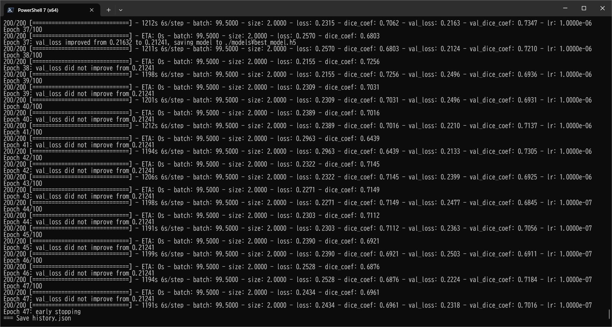 
 

<a href="./projects/TensorflowSlightlyFlexibleUNet/Breast-Ultrasound/eval/train_metrics.csv">train_metrics.csv</a> 
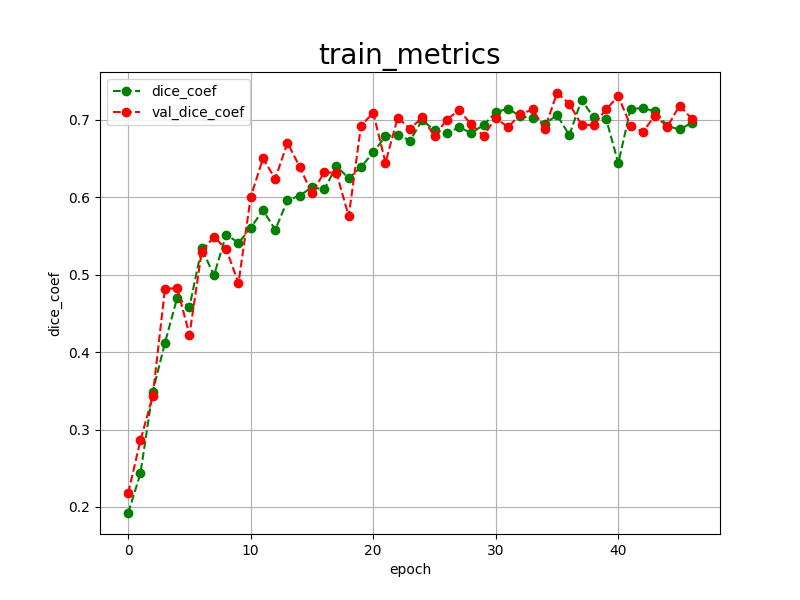 

 
<a href="./projects/TensorflowSlightlyFlexibleUNet/Breast-Ultrasound/eval/train_losses.csv">train_losses.csv</a> 
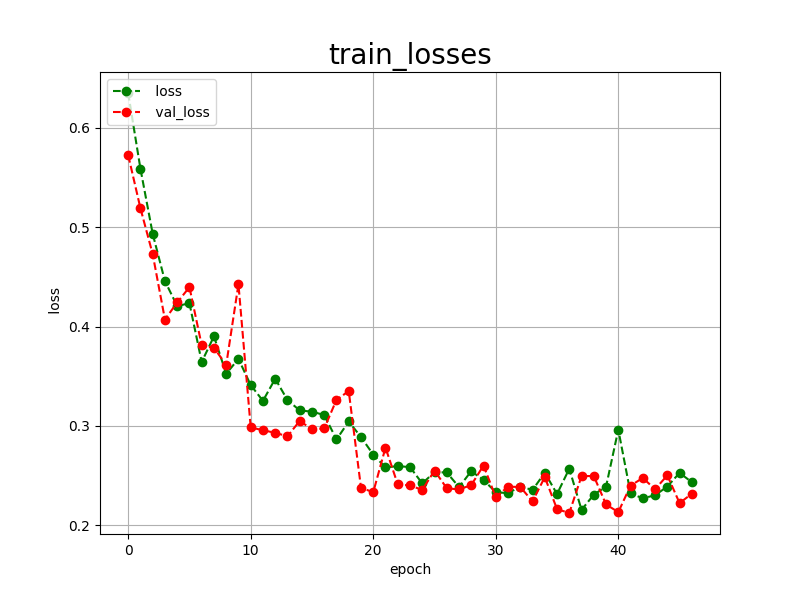 

 

<h3>
4 Evaluation
</h3>
Please move to a <b>./projects/TensorflowSlightlyFlexibleUNet/Breast-Ultrasound</b> folder, 
and run the following bat file to evaluate TensorflowUNet model for Breast-Ultrasound. 
<pre>
./2.evaluate.bat
</pre>
This bat file simply runs the following command.
<pre>
python ../../../src/TensorflowUNetEvaluator.py ./train_eval_infer_aug.config
</pre>

Evaluation console output: 
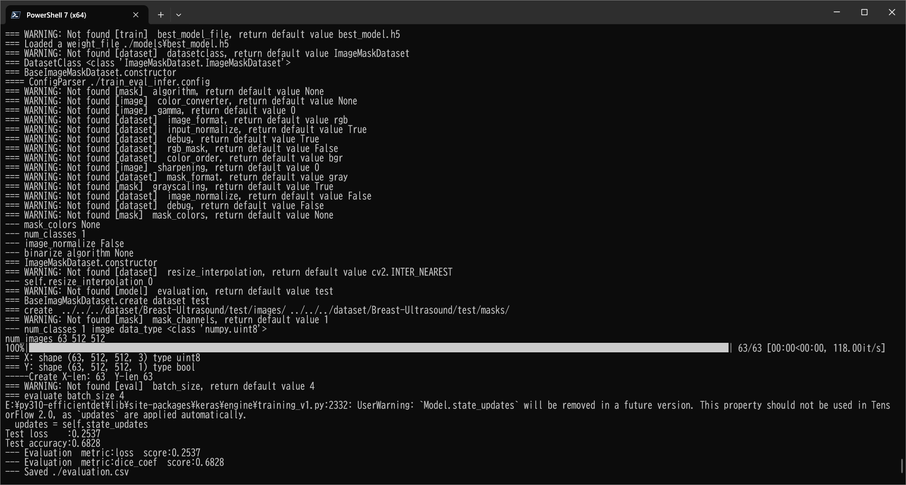
  Image-Segmentation-CDD-CESM-Breast-Ultrasound

<a href="./projects/TensorflowSlightlyFlexibleUNet/Breast-Ultrasound/evaluation.csv">evaluation.csv</a> 

The loss (bce_dice_loss) to this Breast-Ultrasound/test was not low, and dice_coef not high as shown below.
 
<pre>
loss,0.2537
dice_coef,0.6828
</pre>
 

<h3>
5 Inference
</h3>
Please move to a <b>./projects/TensorflowSlightlyFlexibleUNet/Breast-Ultrasound</b> folder 
,and run the following bat file to infer segmentation regions for images by the Trained-TensorflowUNet model for Breast-Ultrasound. 
<pre>
./3.infer.bat
</pre>
This simply runs the following command.
<pre>
python ../../../src/TensorflowUNetInferencer.py ./train_eval_infer_aug.config
</pre>

<b>mini_test_images</b> 
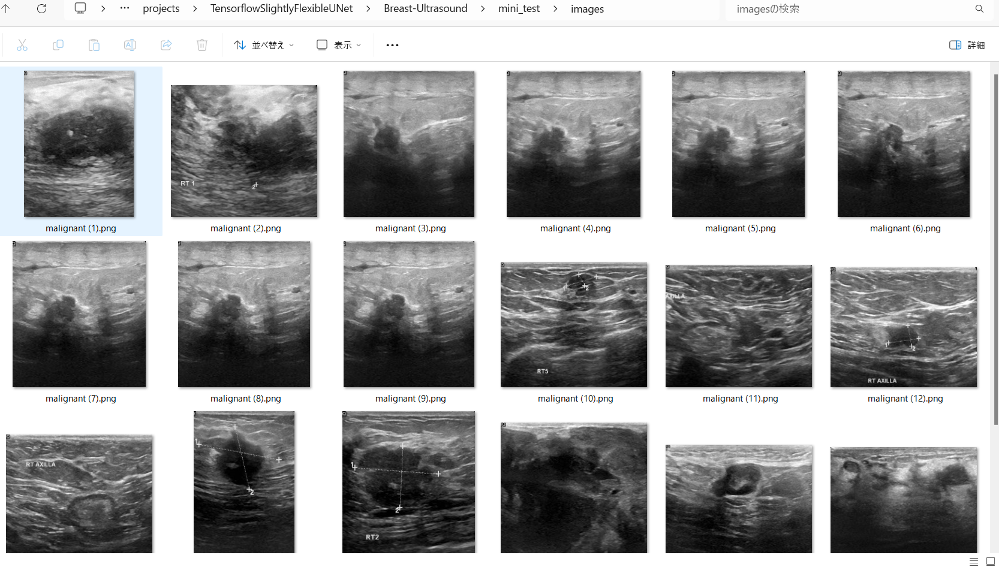 
<b>mini_test_mask(ground_truth)</b> 
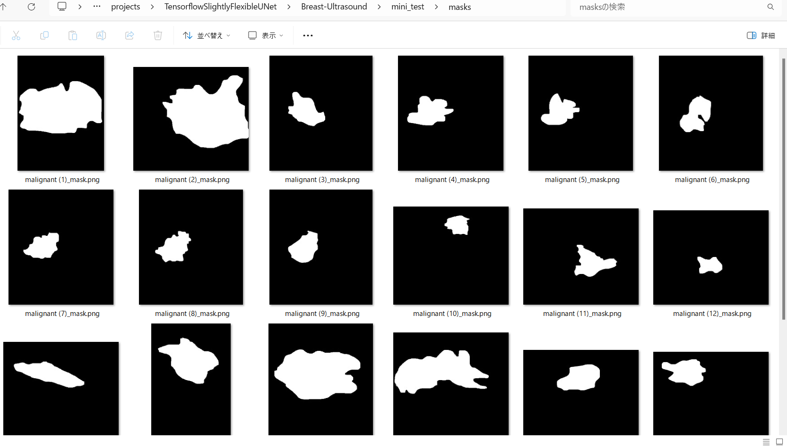 

<b>Inferred test masks</b> 
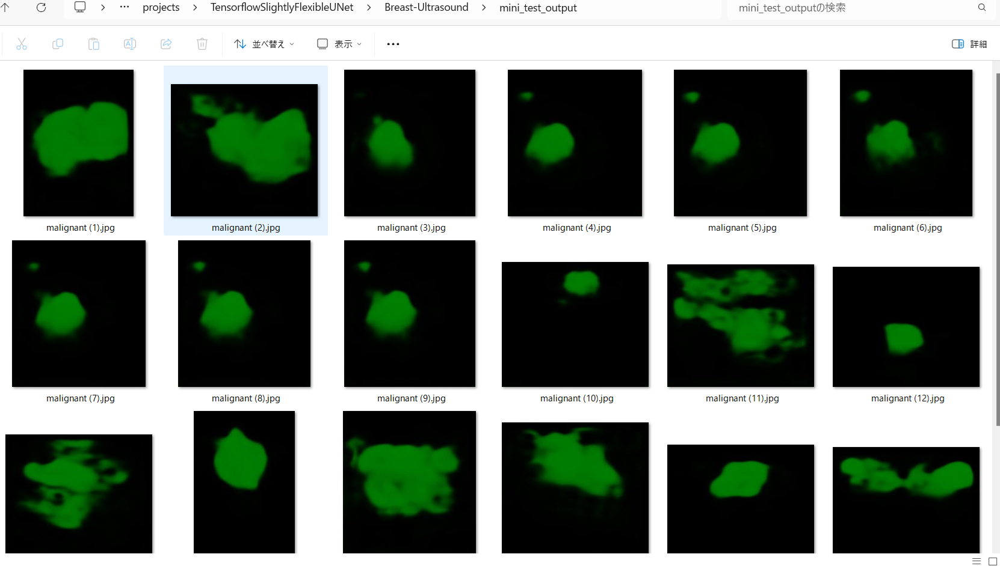 
 

<b>Enlarged images and masks </b> 

<table>
<tr>
<th>Image</th>
<th>Mask (ground_truth)</th>
<th>Inferred-mask</th>
</tr>

<tr>
<td></td>
<td></td>
<td></td>
</tr>

<tr>
<td></td>
<td></td>
<td></td>
</tr>

<tr>
<td></td>
<td></td>
<td></td>
</tr>
<tr>
<td></td>
<td></td>
<td></td>
</tr>
<tr>
<td></td>
<td></td>
<td></td>
</tr>
<tr>
<td></td>
<td></td>
<td></td>
</tr>
</table>

 

<h3>
References
</h3>
<b>1. Breast Ultrasound Images Dataset</b>  
<a href="https://www.kaggle.com/datasets/aryashah2k/breast-ultrasound-images-dataset">
https://www.kaggle.com/datasets/aryashah2k/breast-ultrasound-images-dataset
</a> 
Al-Dhabyani W, Gomaa M, Khaled H, Fahmy A. Dataset of breast ultrasound images.  
Data in Brief. 2020 Feb;28:104863. DOI: 10.1016/j.dib.2019.104863. 
 
